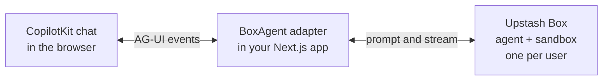

Put a [CopilotKit](https://www.copilotkit.ai) chat in your Next.js app where each user talks to a coding agent running in their own Upstash Box.

Upstash Box combines the agent and its sandbox: the agent runs inside the box, next to the shell and files it works on. CopilotKit is the UI. A small adapter in your app connects the two.



Each user gets one box and one continuing conversation with the agent. The box keeps the agent's files and memory between visits.

---

## 1. Set up

- A **Box API key** from the [Upstash Console](https://console.upstash.com/box).
- An **Anthropic API key** from [API keys](https://platform.claude.com/settings/keys).

```bash title=".env.local"
UPSTASH_BOX_API_KEY=box_xxxxxxxxxxxxxxxxxxxxxxxx
ANTHROPIC_API_KEY=sk-ant-xxxxxxxxxxxxxxxx
```

In a Next.js app:

```bash
npm install @upstash/box@0.7.7 @copilotkit/react-core@1.75.1 @copilotkit/runtime@1.75.1 @ag-ui/client@0.0.59 rxjs@7.8.1
```

<Note>
  These versions were tested together. If you upgrade CopilotKit, match `@ag-ui/client` to the version it depends on: `npm ls @ag-ui/client`.
</Note>

---

## 2. Add the agent

CopilotKit talks to agents over [AG-UI](https://docs.ag-ui.com). This class sends the user's message to the agent in the box and turns the box's stream into AG-UI events.

```typescript title="lib/box-agent.ts"
import { AbstractAgent, EventType, type BaseEvent, type RunAgentInput } from "@ag-ui/client";
import type { Box } from "@upstash/box";
import { Observable } from "rxjs";

export class BoxAgent extends AbstractAgent {
  constructor(private getBox: () => Promise<Box>) {
    super();
  }

  clone() {
    return new BoxAgent(this.getBox) as this;
  }

  run(input: RunAgentInput) {
    const { threadId, runId } = input;
    const content = input.messages.findLast((m) => m.role === "user")?.content;
    const prompt = typeof content === "string" ? content : "";

    return new Observable<BaseEvent>((subscriber) => {
      const emit = (event: object) => subscriber.next(event as BaseEvent);
      let stream: Awaited<ReturnType<Box["agent"]["stream"]>> | undefined;
      let cancelled = false;
      let messageId: string | undefined;

      const endMessage = () => {
        if (messageId) emit({ type: EventType.TEXT_MESSAGE_END, messageId });
        messageId = undefined;
      };

      const forward = async () => {
        emit({ type: EventType.RUN_STARTED, threadId, runId });
        if (!prompt) throw new Error("Send a text message.");
        const box = await this.getBox();
        stream = await box.agent.stream({ prompt });
        if (cancelled) return stream.cancel();

        for await (const chunk of stream) {
          if (chunk.type === "text-delta") {
            if (!messageId) {
              messageId = crypto.randomUUID();
              emit({ type: EventType.TEXT_MESSAGE_START, messageId, role: "assistant" });
            }
            emit({ type: EventType.TEXT_MESSAGE_CONTENT, messageId, delta: chunk.text });
          }
          if (chunk.type === "tool-call") {
            endMessage();
            const toolCallId = chunk.toolCallId;
            const args = JSON.stringify(chunk.input);
            emit({ type: EventType.TOOL_CALL_START, toolCallId, toolCallName: chunk.toolName });
            emit({ type: EventType.TOOL_CALL_ARGS, toolCallId, delta: args });
            emit({ type: EventType.TOOL_CALL_END, toolCallId });
          }
          if (chunk.type === "tool-result") {
            const output = chunk.output;
            const content = typeof output === "string" ? output : JSON.stringify(output);
            emit({
              type: EventType.TOOL_CALL_RESULT,
              messageId: crypto.randomUUID(),
              toolCallId: chunk.toolCallId,
              content,
            });
          }
        }

        endMessage();
        emit({ type: EventType.RUN_FINISHED, threadId, runId });
      };

      forward()
        .catch((error) => emit({ type: EventType.RUN_ERROR, message: String(error) }))
        .finally(() => subscriber.complete());

      return () => {
        cancelled = true;
        stream?.cancel();
      };
    });
  }
}
```

---

## 3. Add the runtime route

Each user gets one box, found by name or created on the first message.

```typescript title="app/api/copilotkit/[[...slug]]/route.ts"
import { CopilotRuntime, InMemoryAgentRunner, createCopilotRuntimeHandler } from "@copilotkit/runtime/v2";
import { Agent, Box, BoxError } from "@upstash/box";
import { BoxAgent } from "@/lib/box-agent";

const getUserId = async (request: Request) => "demo-user";

const isNotFound = (error: unknown) => error instanceof BoxError && error.statusCode === 404;
const isNameTaken = (error: unknown) => error instanceof BoxError && /already in use/.test(error.message);

async function getBox(userId: string) {
  const name = `copilot-${userId}`;
  try {
    return await Box.getByName(name);
  } catch (error) {
    if (!isNotFound(error)) throw error;
  }
  try {
    return await Box.create({
      name,
      agent: {
        harness: Agent.ClaudeCode,
        model: "anthropic/claude-sonnet-5",
        apiKey: process.env.ANTHROPIC_API_KEY,
      },
    });
  } catch (error) {
    if (isNameTaken(error)) return Box.getByName(name);
    throw error;
  }
}

const runtime = new CopilotRuntime({
  agents: async ({ request }) => {
    const userId = await getUserId(request);
    return { default: new BoxAgent(() => getBox(userId)) };
  },
  runner: new InMemoryAgentRunner(),
});

const handler = createCopilotRuntimeHandler({ runtime, basePath: "/api/copilotkit" });

export { handler as GET, handler as POST };
```

---

## 4. Add the chat

`useDefaultRenderTool` shows each tool call the agent makes, such as `Bash` and `Write`, as a card in the chat.

```tsx title="app/page.tsx"
"use client";

import { CopilotChat, CopilotKitProvider, useDefaultRenderTool } from "@copilotkit/react-core/v2";
import "@copilotkit/react-core/v2/styles.css";

function Chat() {
  useDefaultRenderTool();
  return <CopilotChat />;
}

export default function Page() {
  return (
    <CopilotKitProvider runtimeUrl="/api/copilotkit" enableInspector={false}>
      <main style={{ height: "100vh", padding: 24, boxSizing: "border-box" }}>
        <Chat />
      </main>
    </CopilotKitProvider>
  );
}
```

```bash
npm run dev
```

Open `http://localhost:3000` and try:

1. `Create squares.py that prints the first 10 squares, then run it.`
2. Reload the page, then: `Change it to print cubes instead and run it again.`

The chat is empty after the reload, but the agent finds the script and edits it.

---

## Before production

- **Identify users from your auth session.** Replace `getUserId`, and never read the user from the request body: the box name decides whose files the agent can reach.
- **Protect the thread routes.** `InMemoryAgentRunner` records no owner for a thread, so `/api/copilotkit/threads` lists every user's threads. Require authentication, scope thread listings to the signed-in user, and verify that a requested thread belongs to them.
- **Persist chat history.** Store messages outside the server's memory and restore the returning user's thread ID. [Realtime history](/realtime/features/history) and [durable LLM streams](https://upstash.com/blog/resumable-llm-streams) show how to keep messages in Redis Streams and replay them after a reload.
- **One conversation per user.** The thread ID is not sent to the box, so every chat from a user continues the same agent session.

---

## Troubleshooting

- **`BoxAgent` is not assignable to `AbstractAgent`**: your `@ag-ui/client` version differs from the one `@copilotkit/runtime` uses.
- **Permission denied writing files**: the agent can only write under `/workspace/home`.
- **The chat is empty after a reload**: this example keeps visible messages in memory. The agent in the box still has the earlier conversation and files.
- **Box limit reached**: the error comes from `Box.create`. Delete unused boxes in the console or upgrade your plan.
