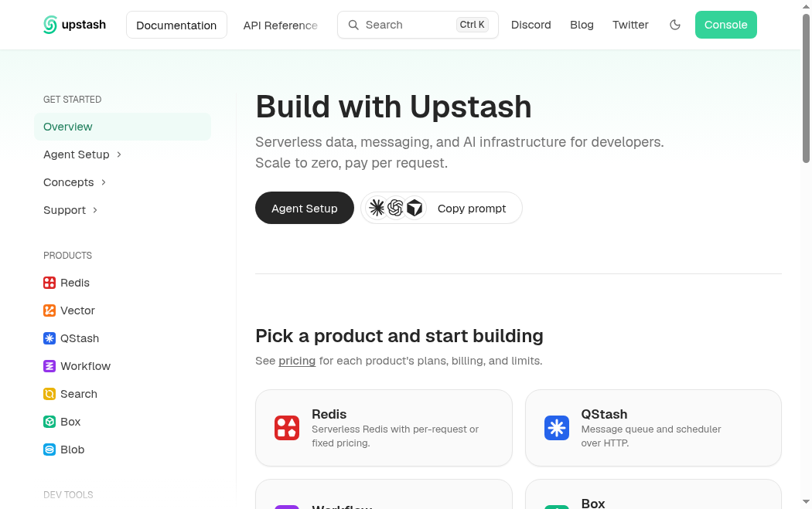
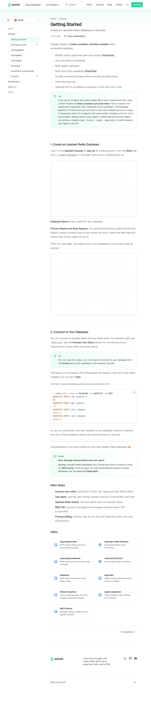

Captured entirely inside an Upstash Box — screenshots taken over CDP from the box itself, never round-tripped through a laptop.

## Setup
- `sudo npm install -g @upstash/docs7`
- `git clone https://github.com/alitariksahin/docs-fork`
- `docs7 dev` → `http://localhost:3333`
- Screenshot via `node inbox-shot.js <url> <out.png>` driving CDP on `127.0.0.1:9222`

## Screenshots

Overview (`/introduction`), viewport:

Redis → Getting Started, full page via `captureBeyondViewport`:

## Note
`docs7 dev` binds `127.0.0.1:3333` only, so it is unreachable through a container port proxy. A `--host 0.0.0.0` option would help remote sandboxes.
